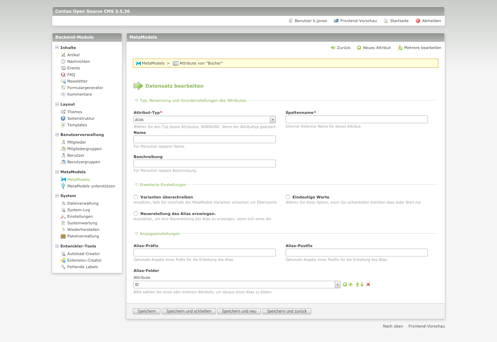
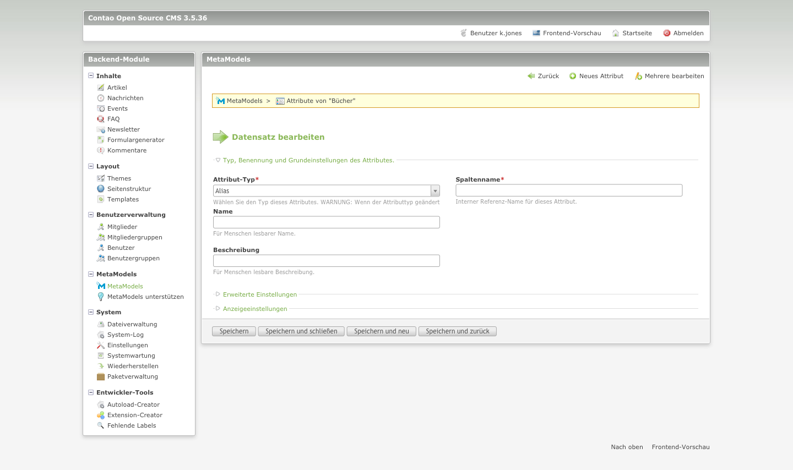
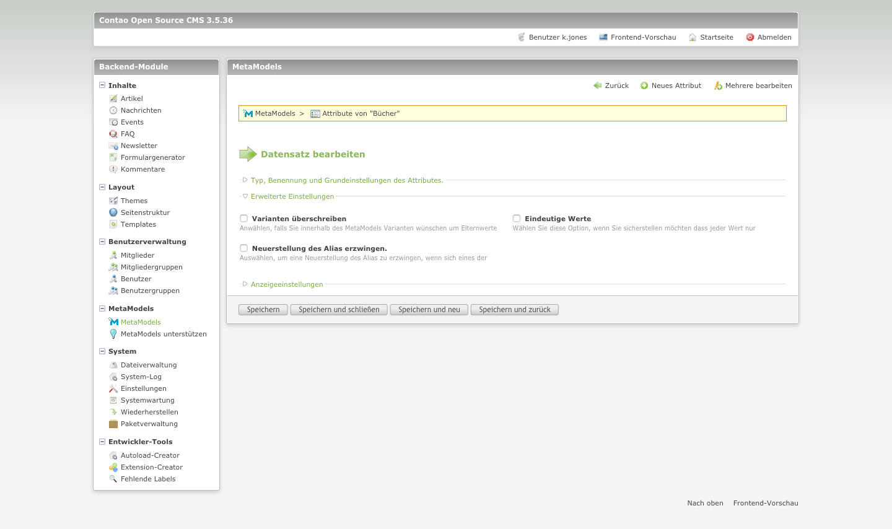
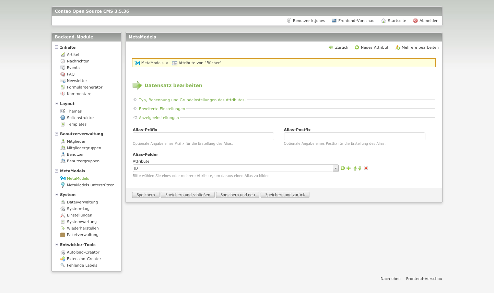
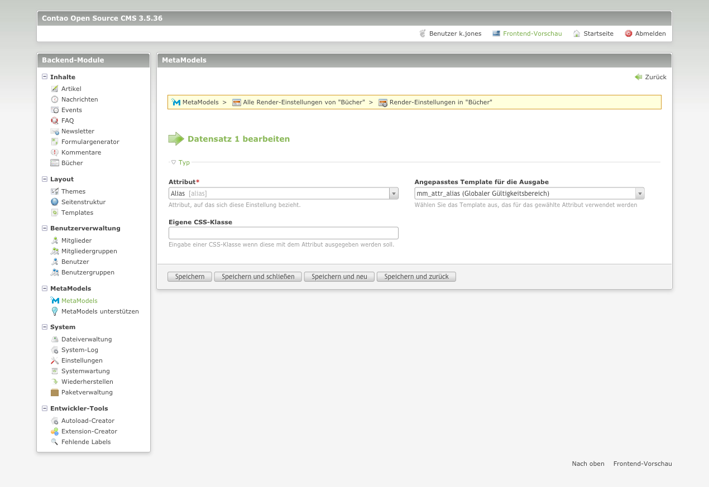

# Das Attribut „Alias“

**Kurzbeschreibung:**

Alias-Feld z.B. für URLs 
der Alias kann als Kombination von verschiedenen (vorhandenen) Attributen erstellt werden; als Option kann die Neuerstellung des Alias bei Änderungen der Ursprungs-Attribute erzwungen werden (Neuerstellung des Alias erzwingen); ein Alias wird nicht automatisch als eindeutiger Wert erstellt - dafür ist eine Aktivierung der Checkbox „Eindeutige Werte“ notwendig 

Im Auswahlfenster des Attributs „Alias“ können folgende Einstellungen vorgenommen werden:

**Typ, Benennung und Grundeinstellungen des Attributes**

- Attribut-Typ
- Spaltenname
- Name
- Beschreibung

**Erweiterte Einstellungen**

- Varianten überschreiben
- Eindeutige Werte
- Neuerstellung des Alias erzwingen.

**Anzeigeeinstellungen**

- Alias-Präfix
- Alias-Postfix
- Alias-Felder

Im Abschnitt **Typ, Benennung und Grundeinstellungen des Attributes** können, wie bereits oben erwähnt verschiedene Einstellungen vorgenommen werden

- Attribut-Typ  
Hier wurde der Attribut-Typ „Alias“ ausgewählt. Bei der Auswahl eines anderen Attribut-Typs verändern sich die möglichen Einstellungen.

- Spaltenname  
Der Spaltenname sollte möglichst eindeutig gewählt werden. Auf Sonderzeichen sollte unbedingt verzichtet werden. Der Spaltennamen entspricht dem späteren Namen unter dem die Informationen in der Datenbank gespeichert werden.

- Name  
Der Name wird im Backend als auch im Frontend angezeigt. Die Anzeige des Namens kann im Frontend abgeschaltet werden. (siehe hierzu ....)

- Beschreibung  
Im Feld Beschreibung kann eine längere Erklärung zum Feld eingegeben werden. Die Beschreibung wird im Backend gekürzt angezeigt, erst wenn mit der Maus über den Beschreibungstext gefahren wird, wird der vollständige Text angezeigt.
Der Beschreibungstext sorgt das eine Barrierefreiheit erreicht wird.

Im Abschnitt **Erweiterte Einstellungen** des Attributes können, wie bereit oben erwähnt verschiedene Einstellungen vorgenommen werden.

- Varianten überschreiben  
  Anwählen, falls Sie innerhalb des MetaModels Varianten wünschen um Elternwerte zu überschreiben.

- Eindeutige Werte  
  Wählen Sie diese Option, wenn Sie sicherstellen möchten dass jeder Wert nur einmal vorkommen kann.

- Neuerstellung des Alias erzwingen.  
  Auswählen, um eine Neuerstellung des Alias zu erzwingen, wenn sich eines der abhängigen Felder ändert. Beachten Sie, dass   bisherige URLs dadurch ungültig werden können.

Im Abschnitt **Anzeigeeinstellungen** des Attributes können, wie bereits oben erwähnt verschiedene Einstellungen vorgenommen werden:

- Alias-Präfix  
  Optionale Angabe eines Präfix für die Erstellung des Alias.

- Alias-Postfix  
  Optionale Angabe eines Postfix für die Erstellung des Alias.

- Alias-Felder  
  Auswählen, um eine Neuerstellung des Alias zu erzwingen, wenn sich eines der abhängigen Felder ändert. Beachten Sie, dass               bisherige URLs dadurch ungültig werden können.

## Die Rendering-Einstellungen

Im Auswahlfenster für das Rendering können folgende Einstellungen vorgenommen werden:

- Attribut  
  Hier das jeweilige Attribut ausgewählt. In diesem Fall wäre dies das Attribut "Alias"

- Angepasstes Template für die Ausgabe  
  Als Standard ist das Template "mm_attr_alias" ausgewählt.

- Eigene CSS-Klasse  
  Hier kann für das jeweilige Alias-Attribut eine eigene CSS-Klasse festegelegt werden.
