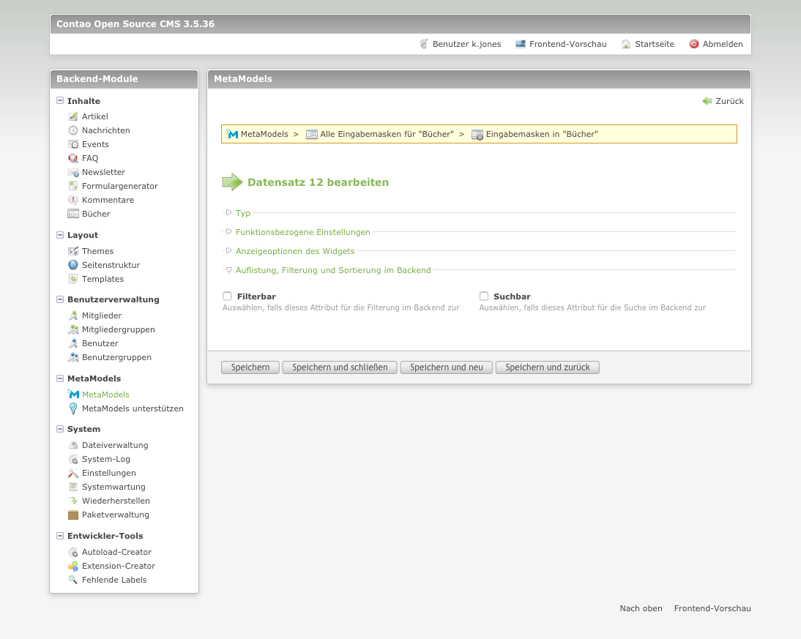

# Das Attribut „Text“

**Kurzbeschreibung:**  

Im Auswahlfenster des Attributs „Text“ können folgende Einstellungen vorgenommen werden:

**Typ, Benennung und Grundeinstellungen des Attributes**

- Attribut-Typ
- Spaltenname
- Name
- Beschreibung

**Erweiterte Einstellungen**

- Varianten überschreiben
- Eindeutige Werte

Im Abschnitt **Typ, Benennung und Grundeinstellungen des Attributes** können, wie bereits oben erwähnt verschiedene Einstellungen vorgenommen werden

- Attribut-Typ  
Hier wurde der Attribut-Typ „Text“ ausgewählt. Bei der Auswahl eines anderen Attribut-Typs verändern sich die möglichen Einstellungen.

- Spaltenname  
Der Spaltenname sollte möglichst eindeutig gewählt werden. Auf Sonderzeichen sollte unbedingt verzichtet werden. Der Spaltennamen entspricht dem späteren Namen unter dem die Informationen in der Datenbank gespeichert werden.

- Name  
Der Name wird im Backend als auch im Frontend angezeigt. Die Anzeige des Namens kann im Frontend abgeschaltet werden. (siehe hierzu ....)

- Beschreibung  
Im Feld Beschreibung kann eine längere Erklärung zum Feld eingegeben werden. Die Beschreibung wird im Backend gekürzt angezeigt, erst wenn mit der Maus über den Beschreibungstext gefahren wird, wird der vollständige Text angezeigt.
Der Beschreibungstext sorgt das eine Barrierefreiheit erreicht wird.

Im Abschnitt **Erweiterte Einstellungen** des Attributes können, wie bereit oben erwähnt verschiedene Einstellungen vorgenommen werden.

- Varianten überschreiben  
  Anwählen, falls Sie innerhalb des MetaModels Varianten wünschen um Elternwerte zu überschreiben.

- Eindeutige Werte  
  Wählen Sie diese Option, wenn Sie sicherstellen möchten dass jeder Wert nur einmal vorkommen kann.

## Die Rendering-Einstellungen

Im Auswahlfenster für das Rendering können folgende Einstellungen vorgenommen werden:

- Attribut  
  Hier das jeweilige Attribut ausgewählt. In diesem Fall wäre dies das Attribut "Alias"

- Angepasstes Template für die Ausgabe  
  Als Standard ist das Template "mm_attr_text" ausgewählt.

- Eigene CSS-Klasse  
  Hier kann für das jeweilige Text-Attribut eine eigene CSS-Klasse festegelegt werden.

## Die Eingabemaske

Im Auswahlfenster für die Eingabemaske können folgende Einstellungen vorgenommen werden:

**Typ**

- Typ
Wählen Sie den Attributstypen aus.

- Attribute
Attribut, auf das sich diese Einstellung bezieht.

**Funktionsbezogene Einstellungen**

- Nur lesen
Wenn aktiviert, erlaubt das Feld nur das Lesen und kann nicht geändert werden.

- Pflichtfeld
Wählen Sie diese Option, wenn das Attribut ein Pflichtfeld ist.

-  Erlaubte HTML-Tags nicht encodieren
Falls angewählt, werden die erlaubten HTML-Tags aus den Systemeinstellungen nicht encodiert.

- Alle HTML-Tags nicht encodieren
Falls angewählt, werden keine HTML-Tags encodiert.

- HTML-Entitäten dekodieren.
Falls ausgewählt werden alle HTML-Entitäten dekodiert. Beachten Sie, dass HTML-Entitäten immer dann decodiert werden, wenn "Erlaubte HTML-Tags nicht encodieren" aktiviert ist.

- Führende '/' bearbeiten
    - Nichts tun
    - Schrägstrich beim Speichern entfernen
    - Schrägstrich beim Speichern hinzufügen

Hier können Sie angeben, wie führende '/' behandelt werden sollen.

- Leerzeichen durch Unterstriche ersetzen
Falls diese Option angewählt ist, werden Leerzeichen durch Unterstriche ersetzt.

- Regular Expression
    - alnum
    - alpha
    - digit
    - email
    - emails
    - extnd
    - friendly
    - phone

Validiert das Feld gegen einen Regulären Ausdruck.

**Anzeigeoptionen des Widgets**

- Backend Klasse
Hier können Sie eine oder mehrere Backend-Klassen festlegen. Benutzen Sie den Stylepicker für eine einfachere Auswahl der Backend-Klassen.

Folgende Einstellungen sind möglich:

**w50 (w50)**

Setzt die Feldbreite auf 50% und floatet das Element (float:left).

**w50x (w50x)**

Entfernt die Voreinstellung für eine feste Höhe. Bitte gemeinsam mit mit "w50" verwenden.

**clr (clr)**

Hebt alle Floats auf.

**clx (clx)**

Entfernt die Voreinstellung "overflow:hidden". Bitte gemeinsam mit mit "clr" verwenden.

**long (long)**

Sorgt dafür, dass das Eingabefeld zwei Spalten umfasst.

**wizard (wizard)**

Verkürzt das Eingabefeld, damit genug Platz für den Wizard (z.B. einen Date Picker) ist.

**m12 (m12)**

Fügt dem Element einen oberen Abstand von 12 Pixeln hinzu (z.B. für einzelne Checkboxen).

**Auflistung, Filterung und Sortierung im Backend**

- Filterbar
Auswählen, falls dieses Attribut für die Filterung im Backend zur Verfügung stehen soll.