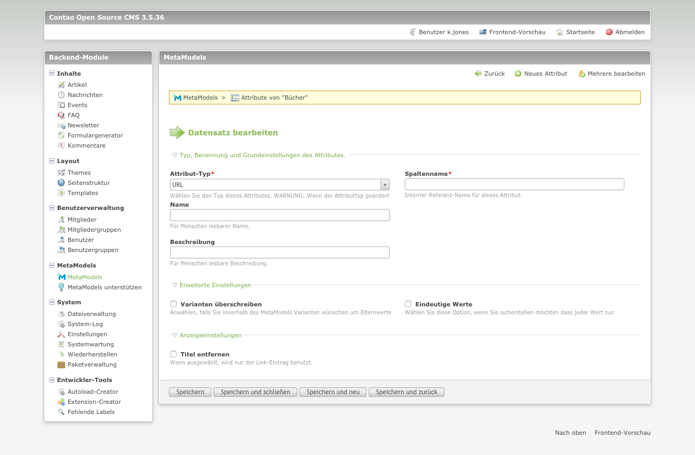

# Das Attribut: „URL“

**Kurzbeschreibung:**
Im Feld URL können neben den Angaben in welcher Tabelle die Daten gespeichert werden vor allem Links zu internen als auch externen Internetseiten gesetzt werden. Optional kann der Titel entfernt werden.

Im Auswahlfenster des Attributs „URL“ können folgende Einstellungen vorgenommen werden:

**Typ, Benennung und Grundeinstellungen des Attributes**

- Attribut-Typ
- Spaltenname
- Name
- Beschreibung

**Erweiterte Einstellungen**

- Varianten überschreiben
- Eindeutige Werte
- Neuerstellung des Alias erzwingen.

**Anzeigeeinstellungen**

- Titel entfernen

Im Abschnitt **Typ, Benennung und Grundeinstellungen des Attributes** können, wie bereits oben erwähnt verschiedene Einstellungen vorgenommen werden

.png)

- Attribut-Typ 
Hier wurde der Attribut-Typ „URL“ ausgewählt. Bei der Auswahl eines anderen Attribut-Typs verändern sich die möglichen Einstellungen. 

- Spaltenname 
Der Spaltenname sollte möglichst eindeutig gewählt werden. Auf Sonderzeichen sollte unbedingt verzichtet werden. Der Spaltennamen entspricht dem späteren Namen unter dem die Informationen in der Datenbank gespeichert werden. 

- Name 
Der Name wird im Backend als auch im Frontend angezeigt. Die Anzeige des Namens kann im Frontend abgeschaltet werden. (siehe hierzu ....) 

- Beschreibung 
Im Feld Beschreibung kann eine längere Erklärung zum Feld eingegeben werden. Die Beschreibung wird im Backend gekürzt angezeigt, erst wenn mit der Maus über den Beschreibungstext gefahren wird, wird der vollständige Text angezeigt.
Der Beschreibungstext sorgt das eine Barrierefreiheit erreicht wird.

Im Abschnitt **Erweiterte Einstellungen des Attributes** können, wie bereit oben erwähnt verschiedene Einstellungen vorgenommen werden.

.png)

- Varianten überschreiben 
Anwählen, falls Sie innerhalb des MetaModels Varianten wünschen um Elternwerte zu überschreiben. 

- Eindeutige Werte 
Wählen Sie diese Option, wenn Sie sicherstellen möchten dass jeder Wert nur einmal vorkommen kann. 

Im Abschnitt **Anzeigeeinstellungen des Attributes** können, wie bereits oben erwähnt verschiedene Einstellungen vorgenommen werden

.png)

- Titel entfernen 
Wird diese Funktion aktiviert wird im Frontend der Titel der URL entfernt. 

## Die Rendering-Einstellungen

Im Auswahlfenster für das Rendering können folgende Einstellungen vorgenommen werden:

- Attribut  
  Hier das jeweilige Attribut ausgewählt. In diesem Fall wäre dies das Attribut "Alias"

- Angepasstes Template für die Ausgabe  
  Als Standard ist das Template "mm_attr_url" ausgewählt.

- Eigene CSS-Klasse  
  Hier kann für das jeweilige Alias-Attribut eine eigene CSS-Klasse festegelegt werden.

- Nicht in neuem Tab öffnen  
Falls ausgewählt wird die URL nicht in einem neuen Browsertab geöffnet.
